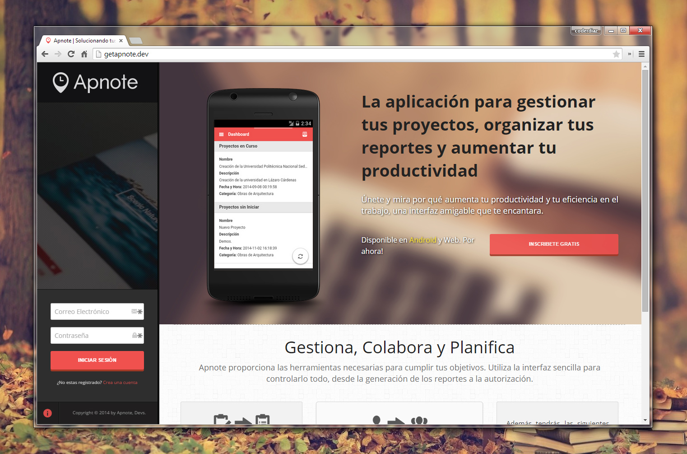
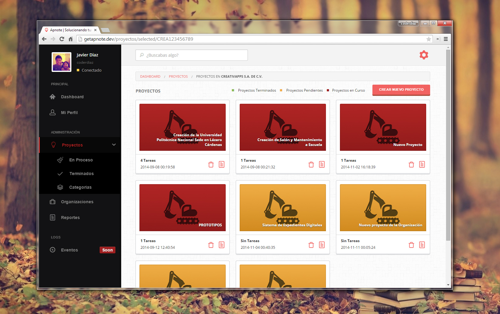
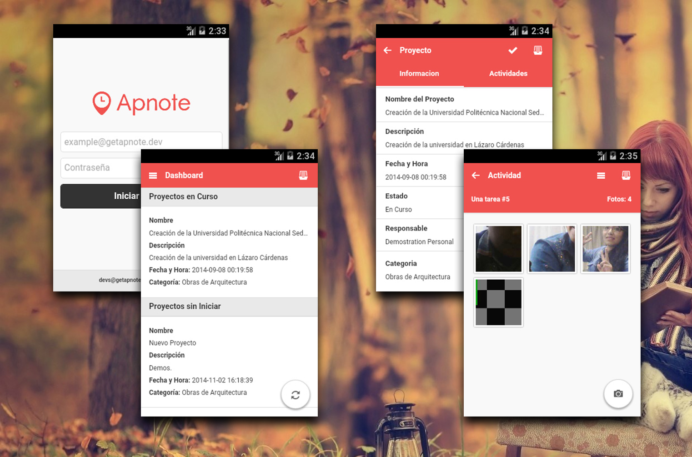

###Proyecto de Titulación Integrada

#####Instituto Tecnológico de Lázaro Cárdenas
######9no Semestre de Ingeniería en Sistemas Computacionales
####Colaboradores

1. **[Javier Diaz](http://github.com/coderdiaz)** | *Co-Fundador y Desarrollador.*
2. **[Daniel Corona](http://github.com/danycor)** | *Co-Fundador y Bug Tester.*
3. **[Salvador Mendoza](http://github.com/simiographics)** | *Desarrollador.*

####Objetivo del Proyecto
Diseñar, desarrollar e implementar una aplicación móvil funcional con la tecnología ANDROID en un dispositivo móvil inalámbrico, aplicando una Metodología MOBILE-D que nos permita el enviar los informes de avances y desarrollo de una obra de Ingeniería Civil deforma inmediata a una plataforma web mediante conexión WI-FI, teniendo disponibilidad de la información en todo momento y pertinencia de la misma.

####Documentación

###### Como iniciar
Tu puedes clonar el proyecto, en el directorio raíz de tu servidor web. Lo puedes hacer con el siguiente comando:
```bash
# Acceso por medio SSH o utiliza el medio HTTPS para clonarlo;
$ git clone git@github.com:coderdiaz/webapnote
```

###### Configuración del Entorno
Para hacer mostrar de forma efectiva y con URL Amigables es recomendable configurar la sobrescritura de direcciones con el archivo `.htaccess` tal como lo muestra en la [Documentación de CodeIgniter](https://ellislab.com/codeigniter/user-guide/general/urls.html) en la sección de `Removing the index.php file`.
```
RewriteEngine on
RewriteCond $1 !^(index\.php|assets|robots\.txt)
RewriteRule ^(.*)$ index.php/$1 [L]
```
Recuerda respetar los términos de licencia de la obra que se describen al final. Si necesitas la base de datos del proyecto, solicitala a este e-mail: [javier.diaz.internaut@gmail.com](mailto:javier.diaz.internaut@gmail.com)

#### Herramientas de Desarrollo
1. [CodeIgniter v2.1.4](http://github.com/EllisLab/CodeIgniter)
2. [Foundation v5.2.2](http://github.com/zurb/foundation)
3. [jQuery v2.1.0](http://jquery.com)
4. [Modernizr v2.7.2](http://modernizr.com)
5. [SweetAlert](http://tristanedwards.me/sweetalert)
6. [FPDF v1.7](http://fpdf.org)

#### Screenshots

###### Plataforma Web



###### Aplicación Móvil


#### Licencia


Copyright &copy; 2014
Esta obra está bajo una [Licencia Creative Commons Atribución-NoComercial-SinDerivadas 4.0 Internacional](http://creativecommons.org/licenses/by-nc-nd/4.0/). Este proyecto fue liberado solo para Uso Didáctico y Aprendizaje. Desarrollado por el Equipo Creativapps, MX.
